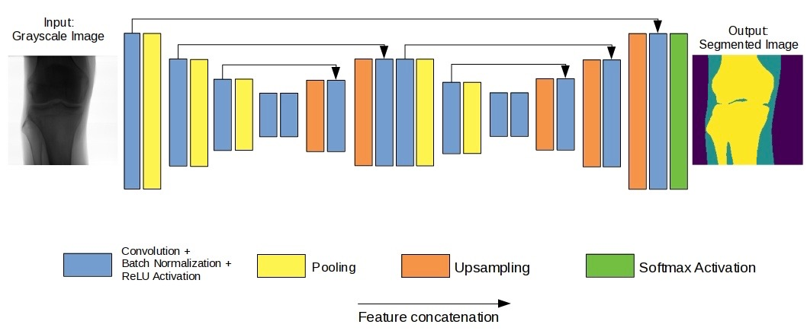

# XNet

XNet is a Convolutional Neural Network designed for the segmentation
of X-Ray images into bone, soft tissue and open beam
regions. Specifically, it performs well on small datasets with the aim
to minimise the number of false positives in the soft tissue class.

This code accompanies the paper published in the SPIE Medical Imaging Conference Proceedings (2019) and can be found on the preprint arXiv at: [arXiv:1812.00548](https://arxiv.org/abs/1812.00548)

## Architecture



* Built on a typical encoder-decoder architecture as
inspired by [SegNet](http://mi.eng.cam.ac.uk/projects/segnet/).

* Additional feature extraction stage, with weight sharing across some
  layers.

* Fine and coarse grained feature preservation through concatenation
  of layers.

* L2 regularisation at each of the convolutional layers, to decrease overfitting. 

The architecture is described in the ```XNet.py``` file.

## Output

XNet outputs a mask of equal size to the input images.


## Training

To train a model:

1. Open ```Training/generate_parameters.py``` and define your desired hyperparameters
2. Run ```Training/generate_parameters.py``` to generate a ```paramteres.txt``` file which is read ```Training/TrainingClass.py```
3. Run ```train.py```

XNet is trained on a small dataset which has undergone augmention. Examples of this augmentation step can be found in the
```Augmentations/augmentations.ipynb``` notebook. Similarly the ```Training``` folder contains python scripts that perform the necessary augementations.

Running ```Training/train.py``` calls various other scripts to perform one of two possible ways of augmenting the images:

* 'On the fly augmentation' where a new set of augmentations is generated at each epoch.

* Pre-augmented images.

To select which method to use comment out the corresponding lines in the ```fit``` function in the ```Training/TrainingClass.py``` script.

```train.py``` also performs postprocessing to fine tune the results.

## Benchmarking

XNet was benchmarked against two of the leading segmentation networks:

* Simplified [SegNet](https://arxiv.org/abs/1511.00561) (found in the
  ```SimpleSegNet.py``` file)

* [UNet](https://arxiv.org/abs/1505.04597) (found in the ```UNet.py```
  file)

## Data

We trained on a dataset of:

* 150 X-Ray images.

* No scatter correction.

* 1500x1500 ```.tif``` image downsampled to 200x200

* 20 human body part classes.

* Highly imbalanced.

As this work grew out of work with a corporation we are sadly unable to share the propriatory data we used.

## More information

For more information and context see the conference poster
```Poster.pdf```.

Please note that some of the path variables may need to be corrected in order to utilise the current filing system. These are planned to be updated in the future.